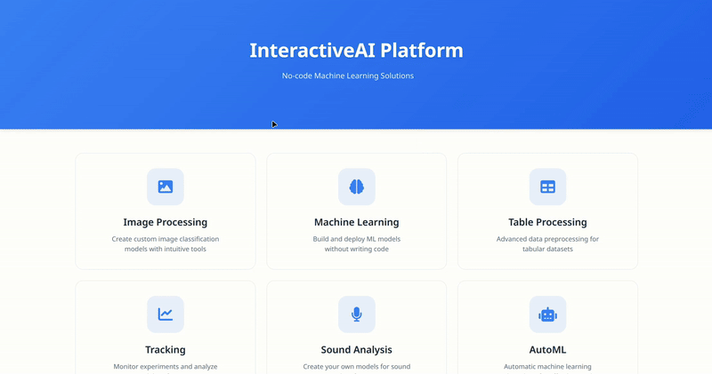
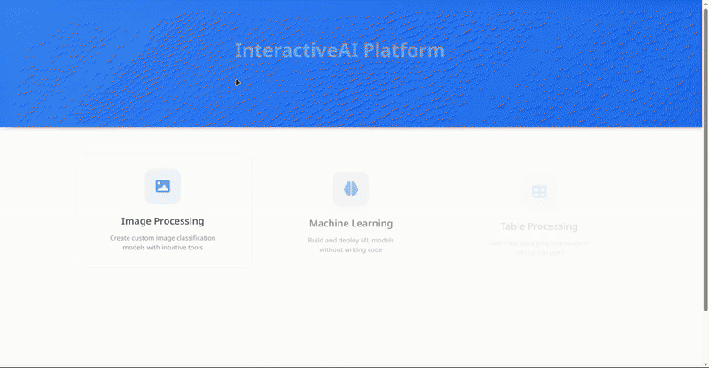

# Interactive AI Model Builder 🤖✨

Interactive AI Model Builder is a user-friendly web application that empowers you to train custom AI models for image, sound classification and different classic ML + autoML experiments directly in your browser. No deep coding expertise required – just bring your data, and let the platform guide you through the process!

## Key Features

*   🌐 **Intuitive Web Interface:** Easily define classes, upload your datasets, and configure training parameters.
*   ⚡ **On-the-Fly Model Training:** Train models for image and sound classification and classic ml tasks.
*   📊 **Real-time Training Logs:** Monitor the training progress directly in the application.
*   📥 **Downloadable Models:** Export your trained models and usage instructions for local inference.
*   💻 **GPU not required:** The application is designed to run efficiently on CPU, making it accessible for users without high-end hardware.
*   🚀 **Powered by PyTorch & Scikit-learn & Yandex DataSphere:** Leverages robust ML & DL frameworks and cloud computing for efficient training.

## 🖼️ Image Classification

Train your own image classifiers by providing example images for different categories. The application handles the complexities of model training, allowing you to focus on your data.

### How It Works:

1.  **Define Classes:** Specify the categories you want to classify (e.g., "Cat", "Dog", "Car").
2.  **Upload Images:** Provide at least 15 images per class in JPG, JPEG, or PNG format.
3.  **Configure Hyperparameters:** Adjust settings like epochs, learning rate, and batch size (sensible defaults are provided).
4.  **Train Model:** The backend uses a pre-trained model (EfficientNet B0) as a feature extractor and trains a custom classification head on your data using Yandex DataSphere.
5.  **Predict & Download:** Test your model with new images via the web interface or download the trained model (`.pt`), class mappings (`.json`), and a Python script for local predictions.

## 🎵 Sound Classification

Classify various sound events by training a model on your audio samples. From environmental sounds to specific audio cues, build a classifier tailored to your needs.

### How It Works:

1.  **Define Classes:** Specify the sound categories (e.g., "Dog Bark", "Siren", "Keyboard Click").
2.  **Upload Audio:** Provide at least 15 audio samples per class (WAV, MP3, FLAC).
3.  **Configure Hyperparameters:** Adjust training parameters, including data augmentation settings.
4.  **Train Model:** The system uses Pre-trained Audio Neural Networks (PANNs) for feature extraction and trains a custom MLP classifier on your audio data using Yandex DataSphere.
5.  **Predict & Download:** Analyze new audio files through the web UI or download the trained MLP model (`.pt`), class mappings (`.json`), and a Python script for local classification using PANNs embeddings.

## 📊 Classic ML & AutoML (Tabular Data)

Easily create and deploy predictive models for structured data. This section enables users to solve classification and regression problems through intuitive workflows that balance manual customization with automated algorithms.

### How It Works:

*   **Upload dataset in CSV format and specify the task type** (supported types: classification, regression)
    

*   **Feature Engineering:** - Perform dataset processing steps or apply automated data processing  (*Coming Soon*)
*   **Model Selection & Training:** - Choose desired model and configure hyperparameters, or select an AutoML algorithm to handle it automatically!
**AutoML:**

**Or classic ML:**

*  **Model Tracking & Export:** - Track model performance and view detailed metrics on the tracking page. Download trained models (.pt format) with usage code.

## 🚀 Getting Started

*   **Clone Repository:** `git clone git@github.com:lpestov/interactive_ai_model_builder.git`
*   **Install Dependencies:** `pip install -r requirements.txt`
*   **Configuration:** `.env` file setup (Yandex Cloud credentials, etc.)
> ⚠️ **IMPORTANT:** You need to get access to Yandex DataSphere for the application to work. Without this access, model training will not be possible!
*   **Running the App:** `flask run`

## 📬 Contacts

If you have any questions or need help with the project:

* **Telegram:**
    * [@lpestov](https://t.me/KersolWIs) - AI Builder Pipeline Engineer (For Yandex DataSphere access)
    * [@MRuslanR](https://t.me/Whoisaltyn) - Classic ML & AutoML Engineer
    * [@VlaLee](https://t.me/v7lee) - Full Stack Developer

## ❤️ Made with Love
